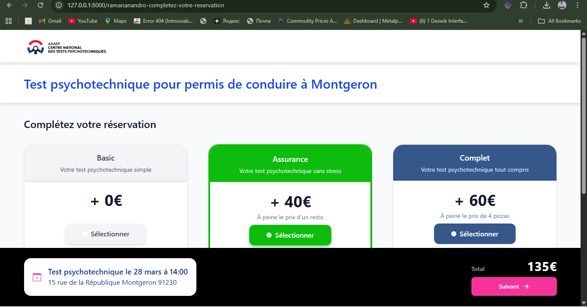
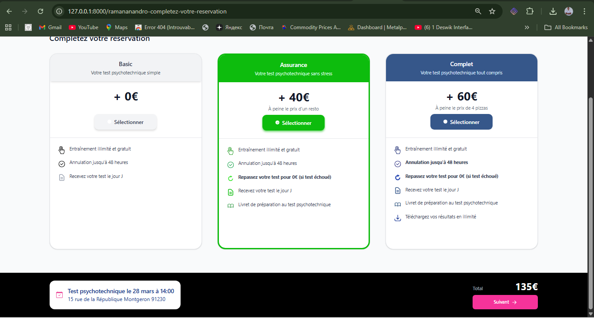
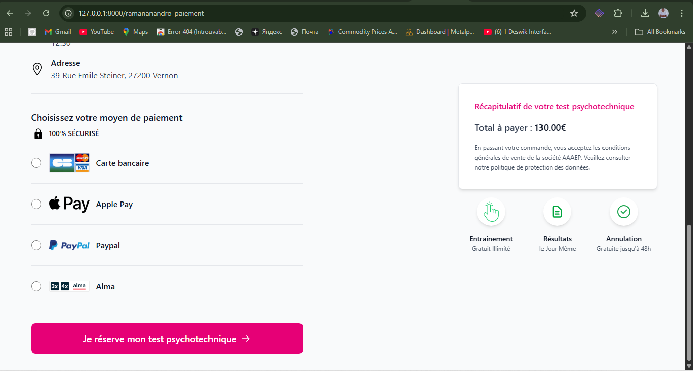
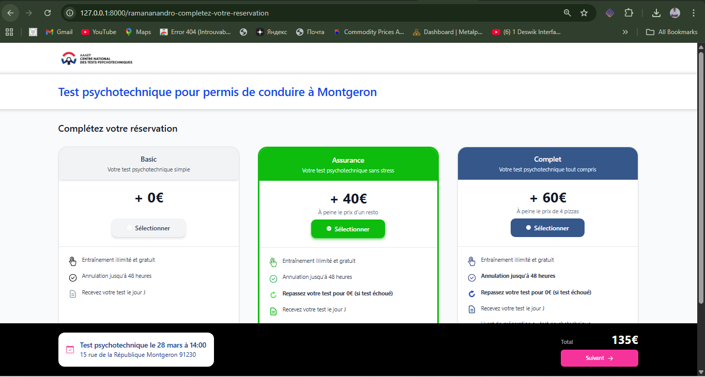
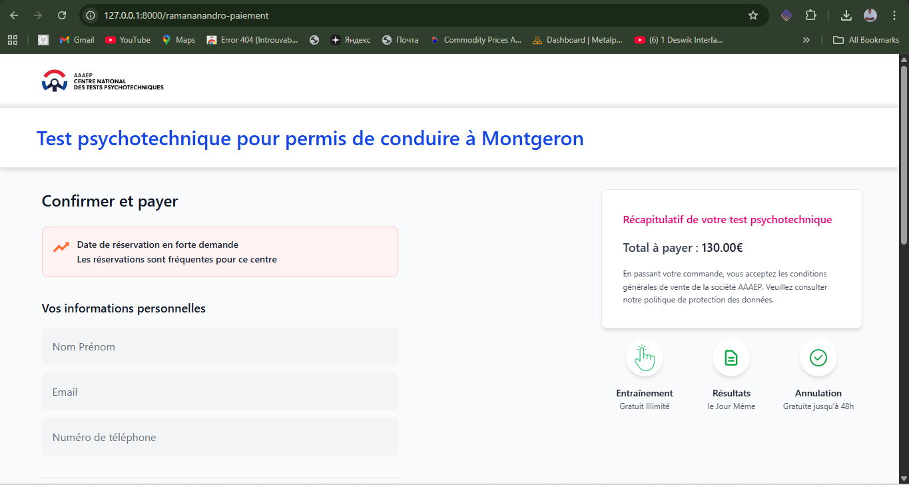

# 🚀 Test technique — Dev Front

Ce README sert de **tutoriel complet pour exécuter le test technique** et documente les **améliorations de design** réalisées sur le projet Laravel + Tailwind CSS.

🔗 **Maquettes Adobe XD** : [Voir la maquette](https://xd.adobe.com/view/47f5bba9-a512-492c-85c6-d4fc4ddebc60-12a6/)

---

## 🎯 1️⃣ Objectif du test
- Reproduire fidèlement l’interface fournie (**Pixel Perfect**)  
- Ajuster **alignements, hiérarchie visuelle et rythme vertical**  
- Documenter les **modifications et arbitrages** dans ce README  

> ⚠️ Le projet est **en cours de refactoring**. Tous les composants sont créés et organisés, mais toutes les pages n’ont pas encore été finalisées. Motivation intacte pour poursuivre l’évolution et compléter le projet.

---

## 🛠️ 2️⃣ Stack & périmètre
| Technologie | Usage |
|------------|-------|
| **Laravel + Blade** | Structure et templates |
| **Tailwind CSS** | Style et responsive |
| **Pages statiques** | Aucune DB nécessaire pour le rendu |
| **Pas de dépendances supplémentaires** | Conformité aux consignes |

---

## ⚡ 3️⃣ Installation et lancement

### 3.1 Cloner le fork GitHub
```bash
git clone https://github.com/<votre-utilisateur>/<nom-du-fork>.git
cd <nom-du-fork>

3.2 Installer les dépendances

composer install
npm install
npm run dev


3.3 Configurer le fichier .env

Comme il est ignoré par GitHub, créez un fichier .env à la racine avec ces valeurs :

APP_NAME=Laravel
APP_ENV=local
APP_KEY=base64:P70jngEVawXYhGwuSVX8ZGn/PZdT6eTYjv3mI7br6Dg=
APP_DEBUG=true
APP_URL=http://localhost

DB_CONNECTION=mysql
DB_HOST=127.0.0.1
DB_PORT=3306
DB_DATABASE=rec_0925_devfront
DB_USERNAME=root
DB_PASSWORD=

3.4 Lancer le serveur Laravel

php artisan serve

Le site sera accessible sur : http://localhost:8000

🌐 4️⃣ Routing personnalisé

Toutes les pages utilisent un routing personnalisé :

/{nom-de-famille}-{slug-de-la-page}

Exemple pour Ramananandro :

Page	URL
Réservation	/ramananandro-completez-votre-reservation
Paiement	/ramananandro-paiement

📂 5️⃣ Architecture du projet (refactoring)

Le projet est structuré pour faciliter la maintenance et l’évolution :

Dossiers principaux
Dossier	Contenu
app/View/Components/	Composants Blade réutilisables (CardPlan.php, alert-warning, payment-options, personal-info-form, reservation-button, security-badge, summary-card, summary-circles, test-info)
resources/views/layouts/	Layout principal (app.blade.php)
resources/views/components/	Templates Blade des composants
resources/views/pages/	Pages principales (completez-votre-reservation.blade.php, paiement.blade.php)
routes/web.php	Déclaration des routes pour chaque page

L’architecture est prête pour accueillir de nouvelles pages et fonctionnalités.

🎨 6️⃣ Notes de design et améliorations

Section “Date de réservation en forte demande” : style warning pour plus de visibilité

Footer : aligné avec les cards et composants, marges ajustées

Header & contenu : alignements harmonisés, rythme vertical respecté

Cards & composants : padding, marges et ombres adaptés à la maquette

Police : fallback Inter pour uniformité

## 📸 7️⃣ Captures d’écran

> Les captures d’écran dans le dossier screenshots sont fournies **pour visualiser le travail effectué**, illustrant la conformité Pixel Perfect, les ajustements de design et l’alignement des composants.

| Description | Capture |
|-------------|---------|
| **Alignement Footer** |  _Footer aligné avec les cards et composants, marges ajustées._ |
| **Card Plan** |  _Card stylisée avec Tailwind, padding et ombre ajustés._ |
| **Formulaire paiement** |  _Champs correctement espacés et style harmonisé._ |
| **Page paiement complète** |  _Toutes les sections alignées et stylisées._ |
| **Page réservation** |  _Composants alignés, rythme vertical respecté._ |
| **Page paiement finale** |  _Vérification Pixel Perfect, cohérence des couleurs et typographie._ |

⏱️ 8️⃣ Temps passé

Temps indicatif : 25 heures

✅ 9️⃣ Conclusion

Projet Pixel Perfect respectant la maquette Adobe XD

Composants modulaires et réutilisables, architecture prête à évoluer
